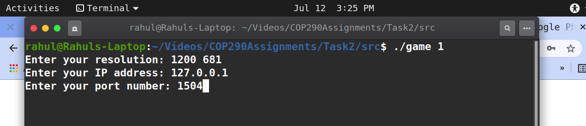

The contents of this Project have been prepared by ***Rahul Chhabra(2019CS11016)*** and ***Shrey Patel(2019CS10400)*** 
**

## Key Points

**
1. The project contains 6 folders:
 
 - ' assets' folder contains images and textures for various visual
   elements of game in theor respective folder.
   
  - 'fonts' folder contains various true type fonts for rendering inside the game on buttons aand scoreboard.
   - 'music' folder contains mp3 file for game background music.
   - 'sounds' folder contains .wav files for various game sounds like collision,game start,eat fruit.
   - 'src' folder contains source code for various components of project
  -  'simulation' folder contains document briefing about simulations of Covi-Wars game 

2. The Makefile which is used to create all executables. 
	
--How to compile?
Type "**make all**" in command line to build the executable game

--How to run the executables?
To execute "**game**" file, type "**./game**" in the command line followed by the 1 if you want to run game as a server and 0 if you want to run game as a client. 
For e.g. "**./game 1** ".After running the executable
the program will ask for the required resolution , ip address and port number
in the console itself.

**

## Notes

**
1) The build file can be cleaned from the directory by typing "make clean" in command line.

2) Double quotes in this document are not to be literally typed in command line, they have been used 
to separate actual commands from plain text.

